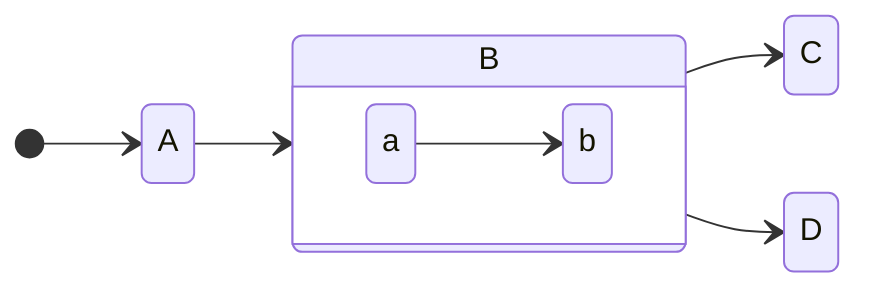

### Hi there 👋
```json
[
    {
        "first name": "ehsan",
        "last name": "sepahi ordeqan",
        "age": 22,
        "created_at": "1379-06-29",
        "fild": "computer engineer",
        "uni": "fani va mohandesi esfarayen"
    },
    {
        "backend developer": {
            "programming language": "PHP",
            "Framework": "LARAVEL",
            "main url": "https://ehsansepahi.online"
        }
    }
]
```


<!--
**ehsanSepahi/ehsanSepahi** is a ✨ _special_ ✨ repository because its `README.md` (this file) appears on your GitHub profile.

Here are some ideas to get you started:

- 🔭 I’m currently working on ...
- 🌱 I’m currently learning ...
- 👯 I’m looking to collaborate on ...
- 🤔 I’m looking for help with ...
- 💬 Ask me about ...
- 📫 How to reach me: ...
- 😄 Pronouns: ...
- ⚡ Fun fact: ...
-->
